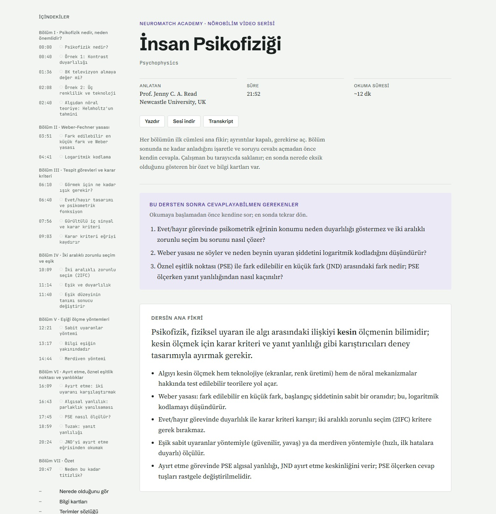
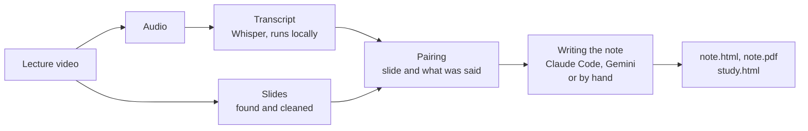
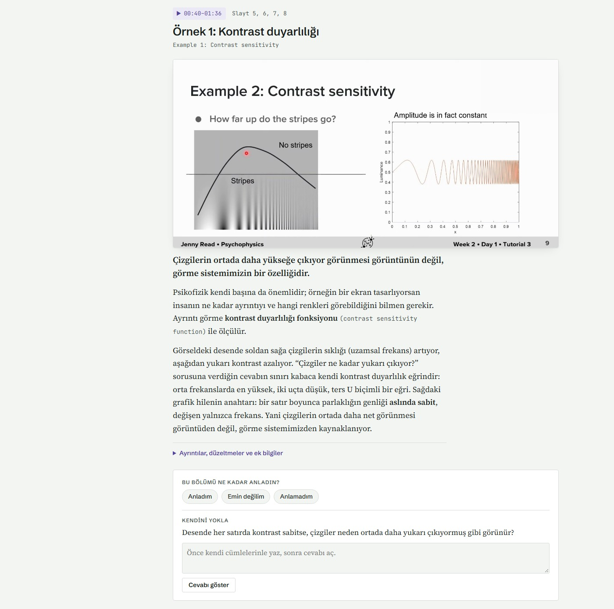

# lecturenotes

Turns a lecture video into a study note: the slides, what the speaker said about each one, and an explanation of how to read the figures, all on one page.

[Türkçe README](README.tr.md)


<sub>A note made from an English lecture and written in Turkish. You can choose the language of the note.</sub>

## Why I made this

My English isn't very good. Most of the lectures I want to learn from are in English, so I watch them with auto-translated subtitles. The translation is often wrong or strange, and while I read it I miss what is on the slide. When I look at the graph, I lose the sentence. If I also try to take notes, I lose both.

So I'd finish a 20-minute video, and I'd have followed it somehow, but I couldn't explain what it was about.

I tried the obvious fix: give the transcript to an AI and ask for notes. The notes looked fine, but the slides weren't in them. "As you can see on this curve" means nothing without the curve, and in a science lecture the curve is usually the whole point. Mistakes also stayed in. In the first lecture I tried, the Turkish subtitles said nerve signals travel at "about 38 km/h". The speaker said 220 miles per hour, which is about 354 km/h. The speech recognition wrote "Bettina" instead of "retina" and "Boba's law" instead of "Weber's law". When the language is already hard for you, you can't catch things like that.

What I wanted was to separate watching from studying. I watch the lecture once and only listen. After that, I study from a note where:

- every slide is next to what the speaker said while it was on screen
- the figures are explained: what the axes are, what the colours mean, what the curve shows
- the text is in my language, with the original English terms kept next to it
- every section has its time in the video, so I can go back and listen again
- errors in the transcript or on the slides are pointed out

For me, this is what makes the difference between "I watched it" and "I understood it". This project is a weekend project I built for that. I'm sharing it in case someone else has the same problem.

### Too long didn't work either

The first notes were very detailed. For a 22-minute lecture where the speaker says about 3,700 words, the note was 6,600 words and took around half an hour to read. And reading a nice, clean note made me feel like I understood the topic, even when I couldn't answer a simple question about it later.

Two papers made me think about this more:

- Loksa et al. (2016) taught beginner programmers the steps of problem solving and asked them to keep track of which step they were on. Those students worked more independently and felt more confident.
- Prather et al. (2024) watched students solve a programming task with AI tools. Many of the students who were struggling finished the task, but they believed they understood more than they actually did.

Both are about programming, not lecture notes. Still, the second one described exactly what was happening to me with long notes.

So I added a study mode. It's shorter, it asks one question at the end of each section, you mark whether you think you understood the section, and at the end it lists the sections where you said "I understood" but got the question wrong. I haven't tested it with other people, so I don't know yet if it really helps. Details are in [docs/study-mode.md](docs/study-mode.md).

## What it does



It doesn't take a screenshot every few seconds. It looks for the moments when the slide actually changes. If bullet points appear one by one, they end up as one slide, in its final state.

It also cleans the images. A webcam box in the corner is removed. If the speaker stands in front of the slide, they are removed too and the text behind them comes back.

It isn't limited to slides. In screen recordings and live coding, every keystroke doesn't become a new slide. For blackboard lectures it picks the frame where the board is easiest to read and skips close-ups of the speaker. Videos with only a talking person become text-only notes.

The result is one HTML file with the images inside it. Clicking the time on a section plays the audio from that point. You also get a PDF, the slides as a ZIP and the transcript.


<sub>One section in study mode: the time (click to listen), the slide, the main idea, the explanation, folded details, "how well did you understand this?" and a question.</sub>

## Installation

You need Python 3.10 or newer. An NVIDIA GPU makes transcription much faster but isn't required. The PDF is printed with Edge or Chrome, if one of them is installed. On first use, the Whisper model (about 1.6 GB) and a small MediaPipe model are downloaded.

```bash
git clone https://github.com/AydinCATALKAYA/lecturenotes.git
cd lecturenotes
python -m venv .venv
```

Activate the environment:

```bash
# Windows
.venv\Scripts\activate
# macOS / Linux
source .venv/bin/activate
```

Then install:

```bash
pip install -e .
```

Optional extras:

- `pip install -e ".[gpu]"` for transcription on an NVIDIA GPU
- `pip install -e ".[gemini]"` if you want Gemini to write the notes
- `pip install -e ".[test]"` to run the tests with `pytest`

## Usage

### 1. Prepare the video

```bash
lecturenotes prepare "my-lecture.mp4"
```

This extracts the audio, transcribes it, finds the slides and matches them with the transcript. Everything goes to `outputs/my-lecture/` in the folder you ran the command from:

- `BRIEF.md`: each slide's time range and what was said
- `slides/`: the cleaned slide images
- `transcript.txt` and `transcript.srt`

A 22-minute lecture took about 3–4 minutes on my laptop GPU.

If you already have subtitles, you can use them instead of Whisper:

```bash
lecturenotes prepare "my-lecture.mp4" --transcript "my-lecture.srt"
```

### 2. Write the note

The note is a JSON file (`note.json`) written from `BRIEF.md` and the slide images. Someone has to write it: you, Claude Code or Gemini.

**With Claude Code.** Open the project folder in [Claude Code](https://claude.com/claude-code), create and install the virtual environment as above, then type:

```
/ders-notu my-lecture.mp4
```

(*Ders notu* means "lecture note" in Turkish.) Claude prepares the video, looks at every slide, writes `note.json` and renders it. The rules it follows are in [.claude/skills/ders-notu/SKILL.md](.claude/skills/ders-notu/SKILL.md).

**With Gemini.** Install the `gemini` extra, create a `.env` file with `GEMINI_API_KEY=your-key` in the folder you run the command from, and run:

```bash
lecturenotes write outputs/my-lecture --lang en
```

It first plans the note, then writes the sections in parallel, then renders it. Use `--lang tr` (or another language code) for a note in another language. On the free Gemini tier there is a small daily request limit; if you hit it, run the same command again the next day and it continues where it stopped.

**By hand or with another model.** Write `note.json` in the format described in the skill file, then:

```bash
lecturenotes render outputs/my-lecture
```

### 3. Study mode (experimental)

Write a `study.json` ([format](docs/study-mode.md#studyjson)) in the same folder and run:

```bash
lecturenotes study outputs/my-lecture
```

This creates `study.html` (with questions and self-rating), `read.html` (the same text without them) and `cards.csv` (flashcards you can import into Anki).

## Which videos work

I tested it on eight lectures:

| Video | Result |
|---|---|
| Slides with a webcam in the corner | Works, webcam removed |
| Full-screen slides with handwriting | Works |
| Speaker standing in front of the slides | Works, speaker removed and text restored |
| Screen recording, live coding | Works |
| Lecture in Turkish | Works, transcription is very good |
| Blackboard, 360p or better | Mostly works, the speaker sometimes blocks the board |
| Blackboard at 320×180 | The board can't be read, sections are text-only |
| Talking head, like a TED talk | Text-only, sometimes picks an audience shot |

If the writing isn't readable in the video, it won't be readable in the note either.

## How it works

- **Audio and transcript.** PyAV extracts the audio (it comes with FFmpeg, nothing else to install). [faster-whisper](https://github.com/SYSTRAN/faster-whisper) runs Whisper `large-v3-turbo` locally.
- **Slides** (`lecturenotes/slides.py`). It samples two small frames per second. Parts of the picture that keep moving while the rest stays still are an overlay:
  - A webcam box with a border is painted over.
  - A speaker without a border is removed with MediaPipe person segmentation and a median over the frames where the slide was on screen.

  After that it splits the video into still stretches and merges stretches that show the same slide or a slide being built up.
- **Blackboard and camera videos.** When most of the frame moves, the video is cut into time windows. Each window keeps the frame with the most chalk or ink, skipping frames where a person fills the view.
- **Pairing.** Each transcript line goes to the slide that was on screen in the middle of that line.
- **Output.** `note.json` goes through a Jinja template into a single HTML file. The PDF is printed with headless Edge or Chrome.

## Limitations

- The thresholds were tuned on eight videos. Different layouts may need adjusting.
- I only tested it on Windows 11 with Python 3.12. macOS and Linux should work, but I haven't tried them.
- There's no web interface, only the command line.
- Gemini writes the normal note. Study notes (`study.json`) aren't generated automatically yet.
- Laser pointer dots sometimes stay on the slides.
- HTML files are 2–8 MB because the images are inside them.
- Study mode hasn't been tested with learners.

## Please only use videos you're allowed to use

There's no downloader in this project, and I won't add one. Use your own recordings, lectures your school gives you access to, or openly licensed videos. Notes made from someone else's lecture are for your own studying, not for publishing.

## References

- Loksa, D., Ko, A. J., Jernigan, W., Oleson, A., Mendez, C. J., & Burnett, M. M. (2016). Programming, Problem Solving, and Self-Awareness: Effects of Explicit Guidance. In *Proceedings of the 2016 CHI Conference on Human Factors in Computing Systems* (pp. 1449–1461). https://doi.org/10.1145/2858036.2858252
- Prather, J., Reeves, B. N., Leinonen, J., MacNeil, S., Randrianasolo, A. S., Becker, B. A., Kimmel, B., Wright, J., & Briggs, B. (2024). The Widening Gap: The Benefits and Harms of Generative AI for Novice Programmers. In *Proceedings of the 2024 ACM Conference on International Computing Education Research* (pp. 469–486). https://doi.org/10.1145/3632620.3671116

## License and credits

The code is under the [MIT license](LICENSE).

It uses [Whisper](https://github.com/openai/whisper) through [faster-whisper](https://github.com/SYSTRAN/faster-whisper) (both MIT), the [MediaPipe](https://github.com/google-ai-edge/mediapipe) selfie segmenter model (Apache 2.0), [PyAV](https://github.com/PyAV-Org/PyAV) and [OpenCV](https://opencv.org/).

The screenshots show a note I made with this project from the lecture "Psychophysics" by Prof. Jenny C. A. Read (Newcastle University), part of the [Neuromatch Academy](https://neuromatch.io/) Neuroscience Video Series. Neuromatch shares its course materials under [CC BY 4.0](https://creativecommons.org/licenses/by/4.0/). The images inside the slides belong to the sources credited on them. If you own the rights and want the screenshots removed, please open an issue.
