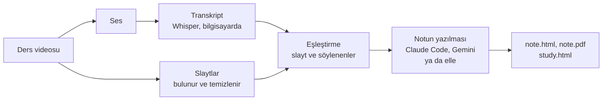

# lecturenotes

Bir ders videosunu çalışma notuna çeviriyor: slaytlar, konuşmacının her slayt hakkında söyledikleri ve grafiklerin nasıl okunacağına dair açıklamalar aynı sayfada.

[English README](README.md)


<sub>İngilizce bir dersten Türkçe yazılmış bir not. Notun dilini sen seçiyorsun.</sub>

## Bu projeyi neden yaptım

İngilizcem çok iyi değil. Öğrenmek istediğim derslerin çoğu İngilizce, o yüzden onları otomatik çevrilmiş altyazıyla izliyorum. Çeviri çoğu zaman yanlış ya da tuhaf. Altyazıyı okurken slaytta ne olduğunu kaçırıyorum. Grafiğe baktığımda cümleyi kaçırıyorum. Bir de not almaya çalışırsam ikisini birden kaçırıyorum.

Sonuçta 20 dakikalık bir videoyu bitiriyorum; bir şekilde takip etmiş oluyorum ama ne anlatıldığını kendi cümlelerimle anlatamıyorum.

Önce akla gelen yolu denedim: transkripti bir yapay zekaya verip not çıkarmasını istedim. Notlar fena görünmüyordu ama slaytlar yoktu. "Bu eğride gördüğünüz gibi" cümlesi, eğri olmadan bir şey ifade etmiyor; bilimsel derslerde de asıl mesele çoğu zaman o eğri. Hatalar da notta kalıyordu. Denediğim ilk derste Türkçe altyazı, sinirlerdeki sinyalin "saatte yaklaşık 38 km" hızla ilerlediğini söylüyordu. Konuşmacı saatte 220 mil demişti, yani yaklaşık 354 km. Konuşma tanıma da "retina" yerine "Bettina", "Weber's law" yerine "Boba's law" yazmıştı. Dil zaten zorlarken bu tür hataları fark etmek mümkün değil.

Benim istediğim, izlemeyle çalışmayı birbirinden ayırmaktı. Dersi bir kere izleyeyim, sadece dinleyeyim. Sonra şöyle bir nottan çalışayım:

- her slayt, ekranda kaldığı sürede söylenenlerin yanında dursun
- grafikler açıklansın: eksenler ne, renkler neyi gösteriyor, eğri ne anlatıyor
- metin Türkçe olsun, İngilizce terimler de yanında kalsın
- her bölümün videodaki zamanı olsun, gerekirse dönüp tekrar dinleyebileyim
- transkriptteki ya da slayttaki hatalar belirtilsin

Benim için "izledim" ile "anladım" arasındaki farkı bu yaratıyor. Bu proje, bunun için yaptığım bir hafta sonu projesi. Aynı sorunu yaşayan başka birinin de işine yarayabilir diye paylaşıyorum.

### Uzun not da işe yaramadı

İlk çıkan notlar çok ayrıntılıydı. Konuşmacının yaklaşık 3.700 kelime söylediği 22 dakikalık bir ders için not 6.600 kelime oldu; okuması yarım saate yakın sürdü. Üstelik düzgün yazılmış bir notu okumak bana konuyu anladığımı hissettiriyordu. Sonra basit bir soru sorulduğunda cevap veremiyordum.

İki makale bu konuda daha çok düşünmemi sağladı:

- Loksa ve arkadaşları (2016), programlamaya yeni başlayan öğrencilere problem çözmenin adımlarını öğretmiş ve hangi adımda olduklarını takip etmelerini istemiş. Bu öğrenciler daha bağımsız çalışmış ve kendilerine daha çok güvenmiş.
- Prather ve arkadaşları (2024), öğrencilerin yapay zeka araçlarıyla bir programlama görevini çözmesini gözlemlemiş. Zorlanan öğrencilerin çoğu görevi bitirmiş, ama aslında anladıklarından daha fazlasını anladıklarını düşünmüşler.

İkisi de not almayla değil programlamayla ilgili. Yine de ikinci makale, uzun notlarla benim yaşadığımı tam olarak anlatıyordu.

Bu yüzden bir çalışma modu ekledim. Daha kısa. Her bölümün sonunda bir soru soruyor. Bölümü anlayıp anlamadığını işaretliyorsun. En sonda da "anladım" deyip soruyu yanlış cevapladığın bölümleri gösteriyor. Başka insanlarla denemedim; gerçekten işe yarayıp yaramadığını henüz bilmiyorum. Ayrıntılar: [docs/study-mode.md](docs/study-mode.md)

## Ne yapıyor



Birkaç saniyede bir ekran görüntüsü almıyor. Slaytın gerçekten değiştiği anları buluyor. Maddeler tek tek açılıyorsa hepsi tek slayt oluyor ve son hâli alınıyor.

Görselleri de temizliyor. Köşedeki kamera kutusunu siliyor. Konuşmacı slaytın önünde duruyorsa onu da siliyor ve arkasında kalan yazıyı geri getiriyor.

Sadece slaytlı videolarla sınırlı değil. Ekran kaydında ve canlı kodlamada her tuş vuruşu yeni bir slayt olmuyor. Kara tahta derslerinde tahtanın en okunaklı olduğu kareyi seçiyor, konuşmacının yakın çekimlerini atlıyor. Sadece konuşan birinin olduğu videolardan da yalnızca metin olan bir not çıkıyor.

Sonuç, görsellerin içinde olduğu tek bir HTML dosyası. Bir bölümün zamanına tıklayınca ses o andan çalıyor. Ayrıca PDF, slaytların ZIP'i ve transkript de çıkıyor.


<sub>Çalışma modunda bir bölüm: zaman (tıklayınca dinlersin), slayt, ana fikir, açıklama, kapalı ayrıntılar, "ne kadar anladın?" ve bir soru.</sub>

## Kurulum

Python 3.10 ya da daha yenisi gerekiyor. NVIDIA ekran kartı transkripti çok hızlandırıyor ama şart değil. PDF, bilgisayarda Edge ya da Chrome varsa onunla oluşturuluyor. İlk kullanımda Whisper modeli (yaklaşık 1,6 GB) ve küçük bir MediaPipe modeli indiriliyor.

```bash
git clone https://github.com/AydinCATALKAYA/lecturenotes.git
cd lecturenotes
python -m venv .venv
```

Ortamı etkinleştir:

```bash
# Windows
.venv\Scripts\activate
# macOS / Linux
source .venv/bin/activate
```

Sonra kur:

```bash
pip install -e .
```

İsteğe bağlı eklentiler:

- `pip install -e ".[gpu]"`: NVIDIA ekran kartıyla transkript için
- `pip install -e ".[gemini]"`: notları Gemini'nin yazması için
- `pip install -e ".[test]"`: testleri `pytest` ile çalıştırmak için

## Kullanım

### 1. Videoyu hazırla

```bash
lecturenotes prepare "dersim.mp4"
```

Bu komut sesi çıkarıyor, yazıya döküyor, slaytları buluyor ve transkriptle eşleştiriyor. Her şey, komutu çalıştırdığın klasördeki `outputs/dersim/` altına yazılıyor:

- `BRIEF.md`: her slaytın zaman aralığı ve o sırada söylenenler
- `slides/`: temizlenmiş slayt görselleri
- `transcript.txt` ve `transcript.srt`

22 dakikalık bir ders benim dizüstü bilgisayarımın ekran kartında 3–4 dakika sürdü.

Elinde altyazı varsa Whisper yerine onu kullanabilirsin:

```bash
lecturenotes prepare "dersim.mp4" --transcript "dersim.srt"
```

### 2. Notu yaz

Not, `BRIEF.md` ve slayt görsellerinden yazılan bir JSON dosyası (`note.json`). Bunu birinin yazması gerekiyor: sen, Claude Code ya da Gemini.

**Claude Code ile.** Proje klasörünü [Claude Code](https://claude.com/claude-code) ile aç, yukarıdaki gibi sanal ortamı kur ve şunu yaz:

```
/ders-notu dersim.mp4
```

Claude videoyu hazırlıyor, bütün slaytlara bakıyor, `note.json` dosyasını yazıyor ve notu oluşturuyor. Uyduğu kurallar [.claude/skills/ders-notu/SKILL.md](.claude/skills/ders-notu/SKILL.md) dosyasında.

**Gemini ile.** `gemini` eklentisini kur. Komutu çalıştıracağın klasörde `GEMINI_API_KEY=anahtarın` satırı olan bir `.env` dosyası oluştur ve şunu çalıştır:

```bash
lecturenotes write outputs/dersim --lang tr
```

Önce notun planını çıkarıyor, sonra bölümleri paralel yazıyor, en sonda notu oluşturuyor. Gemini'nin ücretsiz katmanında günlük istek sınırı düşük; sınıra takılırsan ertesi gün aynı komutu tekrar çalıştır, kaldığı yerden devam eder.

**Elle ya da başka bir modelle.** `note.json` dosyasını skill dosyasındaki formatta yaz, sonra:

```bash
lecturenotes render outputs/dersim
```

### 3. Çalışma modu (deneysel)

Aynı klasöre bir `study.json` yaz ([format](docs/study-mode.md#studyjson)) ve çalıştır:

```bash
lecturenotes study outputs/dersim
```

Üç dosya çıkıyor:

- `study.html`: sorular ve öz değerlendirmeyle
- `read.html`: aynı metin, soru ve değerlendirme olmadan
- `cards.csv`: Anki'ye aktarılabilen bilgi kartları

## Hangi videolarda çalışıyor

Sekiz derste denedim:

| Video | Sonuç |
|---|---|
| Köşede kameralı slaytlar | Çalışıyor, kamera siliniyor |
| Tam ekran slayt ve el yazısı | Çalışıyor |
| Slaytın önünde duran konuşmacı | Çalışıyor, konuşmacı siliniyor, yazı geri geliyor |
| Ekran kaydı, canlı kodlama | Çalışıyor |
| Türkçe ders | Çalışıyor, transkript çok iyi |
| Kara tahta, 360p ya da daha iyi | Çoğunlukla çalışıyor, konuşmacı bazen tahtayı kapatıyor |
| 320×180 çözünürlükte kara tahta | Tahta okunmuyor, bölümler sadece metin |
| Sadece konuşan biri (TED konuşması gibi) | Sadece metin, bazen seyirci görüntüsü seçiyor |

Videoda okunmayan bir yazı notta da okunmuyor.

## Nasıl çalışıyor

- **Ses ve transkript.** Sesi PyAV çıkarıyor (FFmpeg içinde geliyor, ayrıca bir şey kurmak gerekmiyor). [faster-whisper](https://github.com/SYSTRAN/faster-whisper), Whisper `large-v3-turbo` modelini bilgisayarda çalıştırıyor.
- **Slaytlar** (`lecturenotes/slides.py`). Saniyede iki küçük kare alıyor. Görüntünün geri kalanı dururken sürekli hareket eden kısım bir katman:
  - Çerçevesi olan kamera kutusunun üstü boyanıyor.
  - Çerçevesiz konuşmacı, MediaPipe kişi ayırma modeli ve slaytın ekranda kaldığı karelerin medyanı ile siliniyor.

  Sonra video durağan parçalara bölünüyor. Aynı slaytı ya da adım adım açılan bir slaytı gösteren parçalar birleştiriliyor.
- **Kara tahta ve kamera videoları.** Görüntünün çoğu hareket ediyorsa video zaman aralıklarına bölünüyor. Her aralıktan en çok tebeşir ya da mürekkep izi olan kare seçiliyor; bir kişinin ekranı kapladığı kareler atlanıyor.
- **Eşleştirme.** Her transkript satırı, satırın ortasında ekranda olan slayta atanıyor.
- **Çıktı.** `note.json`, bir Jinja şablonuyla tek bir HTML dosyasına dönüşüyor. PDF, arka planda çalışan Edge ya da Chrome ile oluşturuluyor.

## Sınırlar

- Eşik değerlerini sekiz videoya göre ayarladım. Farklı düzenlerde ayar gerekebilir.
- Sadece Windows 11 ve Python 3.12'de denedim. macOS ve Linux'ta çalışması lazım ama denemedim.
- Web arayüzü yok, sadece komut satırı var.
- Gemini normal notu yazıyor. Çalışma modu notları (`study.json`) henüz otomatik yazılmıyor.
- Slaytlarda bazen lazer imlecinin noktası kalıyor.
- Görseller içinde olduğu için HTML dosyaları 2–8 MB.
- Çalışma modunu öğrencilerle denemedim.

## Lütfen sadece kullanma hakkın olan videoları kullan

Projede video indirme aracı yok, eklemeyeceğim de. Kendi kayıtlarını, okulunun erişim verdiği dersleri ya da açık lisanslı videoları kullan. Başkasının dersinden çıkardığın notlar kendi çalışman için, yayımlamak için değil.

## Kaynaklar

- Loksa, D., Ko, A. J., Jernigan, W., Oleson, A., Mendez, C. J., & Burnett, M. M. (2016). Programming, Problem Solving, and Self-Awareness: Effects of Explicit Guidance. *Proceedings of the 2016 CHI Conference on Human Factors in Computing Systems* içinde (s. 1449–1461). https://doi.org/10.1145/2858036.2858252
- Prather, J., Reeves, B. N., Leinonen, J., MacNeil, S., Randrianasolo, A. S., Becker, B. A., Kimmel, B., Wright, J., & Briggs, B. (2024). The Widening Gap: The Benefits and Harms of Generative AI for Novice Programmers. *Proceedings of the 2024 ACM Conference on International Computing Education Research* içinde (s. 469–486). https://doi.org/10.1145/3632620.3671116

## Lisans ve teşekkürler

Kod [MIT lisansı](LICENSE) ile paylaşılıyor.

Kullandıklarım: [Whisper](https://github.com/openai/whisper), [faster-whisper](https://github.com/SYSTRAN/faster-whisper) üzerinden (ikisi de MIT); [MediaPipe](https://github.com/google-ai-edge/mediapipe) selfie segmenter modeli (Apache 2.0); [PyAV](https://github.com/PyAV-Org/PyAV) ve [OpenCV](https://opencv.org/).

Ekran görüntülerindeki notu bu projeyle, [Neuromatch Academy](https://neuromatch.io/) Nörobilim Video Serisi'ndeki Prof. Jenny C. A. Read'in (Newcastle University) "Psychophysics" dersinden çıkardım. Neuromatch ders materyallerini [CC BY 4.0](https://creativecommons.org/licenses/by/4.0/) ile paylaşıyor. Slaytların içindeki görseller, üzerlerinde belirtilen kaynaklara ait. Hak sahibiysen ve bu görüntülerin kaldırılmasını istiyorsan lütfen bir issue aç.
